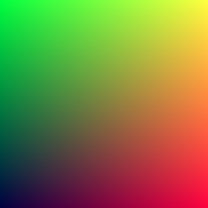
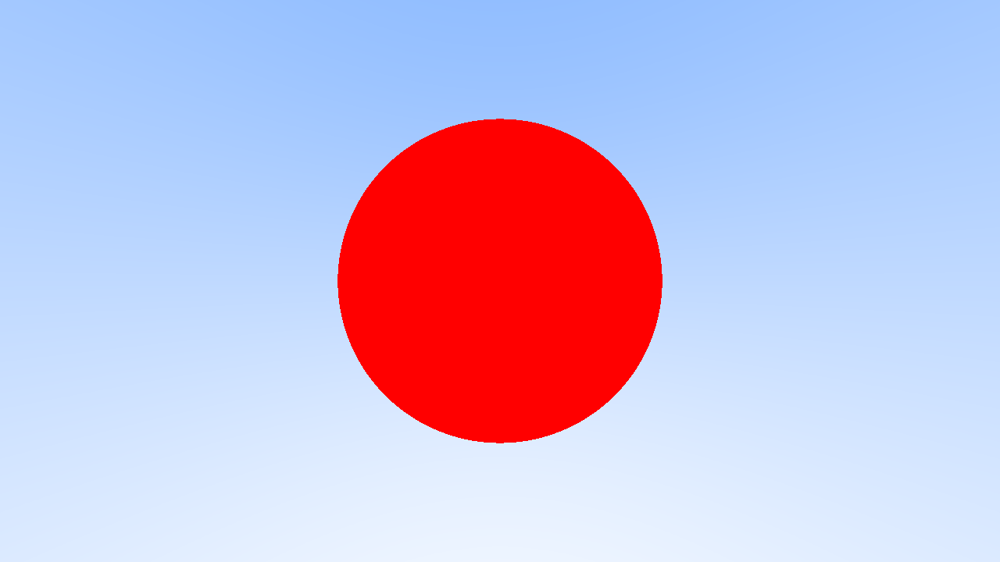

# Rust Ray Tracer

Rust implementation of [Ray Tracing In One Weekend](https://raytracing.github.io/books/RayTracingInOneWeekend.html), with the goal of learning about Rust and ray tracing... at the same time.

## Progress

### Vector3

### Rays

### Sphere

### Surface Normals

